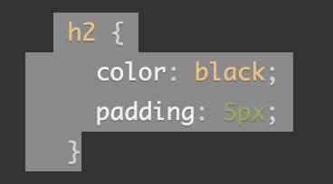

## Basics of HTML, CSS, JS

### Introduction to HTML
#### Why is it important to use semantic elements in our HTML?

Some of the benefits from writing semantic markup are as follows:

> 1. Search engines will consider its contents as important keywords to influence the page's search rankings (see SEO)

> 2. Screen readers can use it as a signpost to help visually impaired users navigate a page

> 3. Finding blocks of meaningful code is significantly easier than searching through endless divs with or without semantic or namespaced classes

> 4. Suggests to the developer the type of data that will be populated

> 5. Semantic naming mirrors proper custom element/component naming

#### How many levels of headings are there in HTML?

> There are 6 levels of headings, with h1 being the highest section level and h6 is the lowest.

#### What are some uses for the `` and `` elements?

- sup : The ``, or superscripts, are usually rendered with a *raised* baseline using smaller text.
> Example: Displaying exponents (x 4), or representing ordinal numbers (4th)

- sub: the ``, or subscripts, are typically rendered with a *lowered* baseline using smaller text.
> Example: marking up footnote numbers or denoting the number of atoms of a given element within a chemical formula (H 20).

#### When using the <abbr> element, what attribute must be added to provide the full expansion of the term?

> the `title` attribute, along with a full description and nothing else can provide an expansion for the abbreviation or acronym when a full expansion is not present.

##### Sources

- [Introduction to HTML](https://developer.mozilla.org/en-US/docs/Learn/HTML/Introduction_to_HTML/)

- [HTML Text Fundamentals](https://developer.mozilla.org/en-US/docs/Learn/HTML/Introduction_to_HTML/HTML_text_fundamentals)

- [HTML Advanced Text Formatting](https://developer.mozilla.org/en-US/docs/Learn/HTML/Introduction_to_HTML/Advanced_text_formatting)

### Learn CSS

#### What are ways we can apply CSS to our HTML?

> CSS can be applied to an HTML document through 3 methods:
1. an external stylesheet (`<link rel="stylesheet" href="styles.css" />`)
2. with an internal stylesheet (``)
3. or with inline syles. (`
#1 CSS example
`)

#### Why should we avoid using inline styles?

Because one change might require multuple edits within a single web page CSS will mix presentational code with HTML and content, making everything more difficult to read and understand. Separating code and content makes maintenance easier for all who work on the website.

### *Review the block of code below and answer the following questions*:

   
1. What is representing the selector?
> The selector, `h2`, will target all of the `<h2>` elements on the page.

2. Which components are the CSS declarations?
> `color: black` and `padding: 5px;` are the CSS declarations.

3. Which components are considered properties?
> `color` and `padding` are the properties.

##### Sources
[How CSS Is Structured](https://developer.mozilla.org/en-US/docs/Learn/CSS/First_steps/How_CSS_is_structured)

### Learn JS

#### What data type is a sequence of text enclosed in single quote marks?

> A string is a sequence of text eclosed in single (or double) quote marks.

#### List 4 types of JavaScript operators.

*An operator is a mathematical symbol that produces a result based on two values (or variables). 

> 1. Addition (`+`) - Add two numbers together or combine two strings.
`Example: 3 + 7; 'Hey' + 'world!;`

> 2. Subtraction, Multiplication, Division	(`-`, `*`, `/`) - These do what you'd expect them to do in basic math.	

> 3. Assignment (`=`)
`Example: let myVariable = 'Jane';`

> 4. Strict equality	(`===`) or loose equality (`==`)

>5. Not, Does-not-equal	 (`!, !==')

#### Describe a real world Problem you could solve with a Function.

> A function could be used to protect a customer's account with a secure password, or compute the total of an online store's cart whenever the customer selects the "checkout" button!

#### An if statement checks a `__` and if it evaluates to `___`, then the code block will execute.

> An if statement checks a `condition` and if it evaluates to `be true`, then the code block will execute.

#### What is the use of an else if?

> An else if statement in Javascript is used when you have more than two possible outcomes, with each outcome requiring different conditions to be checked.

#### List 3 different types of comparison operators.

> 1. `===` and `!==` — test if one value is identical to, or not identical to, another.

> 2. `<` and `>` — test if one value is less than or greater than another.

> 3. `<=` and `>=` — test if one value is less than or equal to, or greater than or equal to, another.

#### What is the difference between the logical operator && and ||?

- `&&` — AND; allows you to chain together two or more expressions so that all of them have to individually evaluate to true for the whole expression to return true.

- `||` — OR; allows you to chain together two or more expressions so that one or more of them have to individually evaluate to true for the whole expression to return true.

##### Source
- [JavaScript Basics- ("comments" - "events")](https://developer.mozilla.org/en-US/docs/Learn/Getting_started_with_the_web/JavaScript_basics)
- [Making Decisions In Your Code – Conditionals](https://developer.mozilla.org/en-US/docs/Learn/JavaScript/Building_blocks/conditionals)

## Things I want to know more about 
1.) Javascript is a very complex code, and i'm wondering how deep the pool goes. Beyond ele,if and for loops, what other options are there and how complicated does it get?

*[Bookmarked and Reviewed](https://chris.beams.io/posts/git-commit/)*
