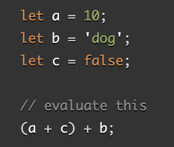

## HTML Lists, Control Flow with JS, and the CSS Box Model

### Learn HTML

#### When should you use an unordered list in your HTML document?

> Unordered lists, or `<ul>`, is commonly used whenever the order of the list is unimportant, such as in navigation menus, grouping, or bullet points.

#### How do you change the bullet style of unordered list items?

> Use the CSS `list-style-type: #`, which accepts several values (such as `square`,`circle` or `disc`)

#### When should you use an ordered list vs an unordered list in your HTML document?

> Use an *ordered* list when the order of the items in the list is important. For example, a recipe with steps in the order they should be performed, or if you  want to display a ranked list.

> Use an *unordered* list when the order of the items in the list is not important. For example,
you want to display a list of items that are not ranked or ordered, such as a list of grocery items.

#### Describe two ways you can change the numbers on list items provided by an ordered list?

> 1. Use `start="4">`to start numbering elements from the number 4 (or whatever nuumber you choose to start on.)

>2. Use `type="#">` to set the numbering type and choose from the below values:
- `a` for lowercase letters
- `A` for uppercase letters
- `i` for lowercase Roman numerals
- `I` for uppercase Roman numerals
- `1` for numbers (default)

##### Sources
- [Learn HTML](https://developer.mozilla.org/en-US/docs/Web/HTML)

- [Ordered Lists](https://developer.mozilla.org/en-US/docs/Web/HTML/Element/ol)

- [Unordered Lists](https://developer.mozilla.org/en-US/docs/Web/HTML/Element/ul)

### Learn CSS

#### Describe the CSS properties of margin and padding as characters in a story. What is their role in a story titled: “The Box Model”?

> In a story titled "The Box Model", margin and padding are in a relationship... but padding is incarcerated and behind a border (behind bars).

- Padding box: The padding sits around the content as white space. It can be re-sized using padding and related properties.

- Margin box: The margin is the outermost layer, wrapping the content, padding, and border as whitespace between this box and other elements; size it using margin and related properties.

#### List and describe the four parts of an HTML elements box as referred to by the box model.

> 1. Content is the text of the HTML element enclosed by padding, border, and margin.

> 2. Padding is the space (or "room") between the text and its border.

> 3. Border is line(s) that surrounds the text/ padding of the element.

> 4. Margin is the space between the border and the other elements on the webpage.

##### Sources
- [The Box Model](https://developer.mozilla.org/en-US/docs/Learn/CSS/Building_blocks/The_box_model)

### Learn JS

#### What data types can you store inside of an Array?

> In an array we can store various data types — strings, numbers, objects, and even other arrays. 

#### Is the people array a valid JavaScript array? If so, how can I access the values stored? If not, why?

 `const people = [['pete', 32, 'librarian', null], ['Smith', 40, 'accountant', 'fishing:hiking:rock_climbing'], ['bill', null, 'artist', null]];`

>Yes, the `people` array is valid. In order to access the values stored you can use array indexing.
If you try to access an element that doesn't exist in the array, you will get a undefined value.

#### List five shorthand operators for assignment in javascript and describe what they do.

> 1. `+=` - operator adds the value on the right to the existing value on the left and assigns the result to the variable on the left. For example, `x += 2` is equivalent to `x = x + 2`.

> 2. `-=` - operator subtracts the value on the right from the existing value on the left and assigns the result to the variable on the left. For example, `x -= 2` is equivalent to `x = x - 2`.

> 3. `*=` -operator multiplies the existing value on the left by the value on the right and assigns the result to the variable on the left. For example, `x *= 2` is equivalent to `x = x * 2`.

> 4. `/=` - operator divides the existing value on the left by the value on the right and assigns the result to the variable on the left. For example, `x /= 2` is equivalent to `x = x / 2`.

> 5. `%=` - operator performs a modulo operation on the existing value on the left with the value on the right and assigns the result to the variable on the left. For example, `x %= 2` is equivalent to `x = x % 2`, which means x is assigned the remainder when it is divided by 2.

#### Read the code below and evaluate the last expression and explain what the result would be and why.

> (a + c) + b evaluates to the string '10dog'
> The parentheses are asking to be evaluated first. `a=10` + `c=false` will result in a numeric value, because false will be coerced to the number 0. Therefore `(a + c) = 10` and 10 + 'dog' equates to '10dog'.

#### Describe a real world example of when a conditional statement should be used in a JavaScript program.

> a real work example of a condtional statement is when a user sets up a protective username and password to protect their account. Each time they login, they will be prompted for their password, and not allowed in until the `===` password is entered.

#### Give an example of when a Loop is useful in JavaScript.

> Loops can be used in various scenarios, including iterating over objects or repeating an action a specific number of times. An example would be if we wanted to draw 100 random circles on an element in a webpage.

##### Sources

- [Learn JS](https://developer.mozilla.org/en-US/docs/Learn/JavaScript)
- [Arrays](https://developer.mozilla.org/en-US/docs/Learn/JavaScript/First_steps/Arrays)
- [Operators and expressions](https://developer.mozilla.org/en-US/docs/Web/JavaScript/Guide/Expressions_and_Operators)
- [Conditionals](https://developer.mozilla.org/en-US/docs/Learn/JavaScript/Building_blocks/conditionals)
- [Loops](https://developer.mozilla.org/en-US/docs/Learn/JavaScript/Building_blocks/Looping_code)

## Things I want to know more about
 - I would like to learn more about looping in JavaScript.
