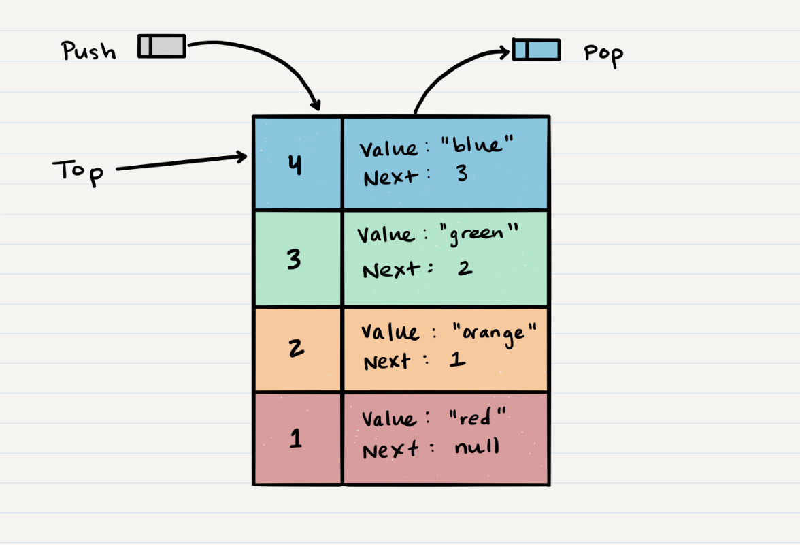
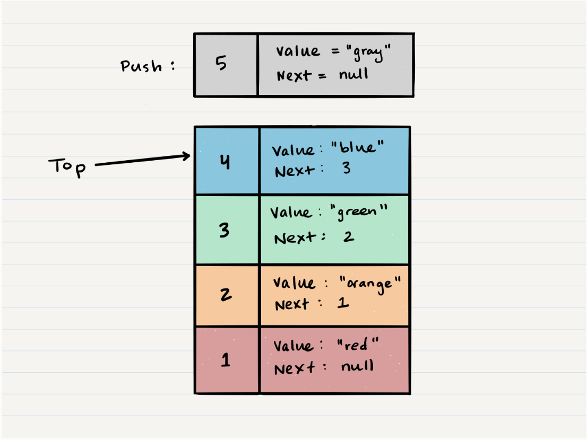
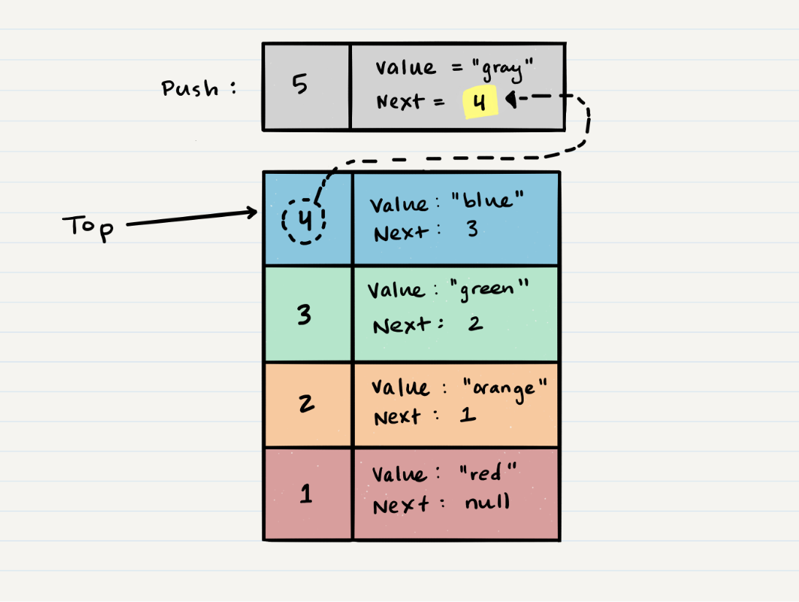
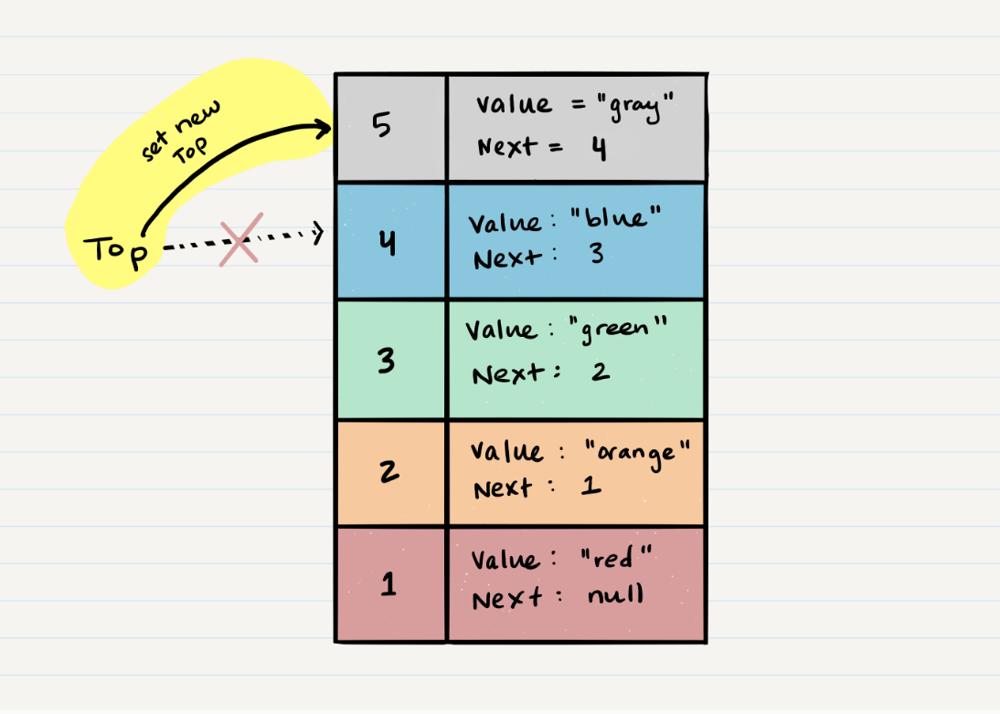
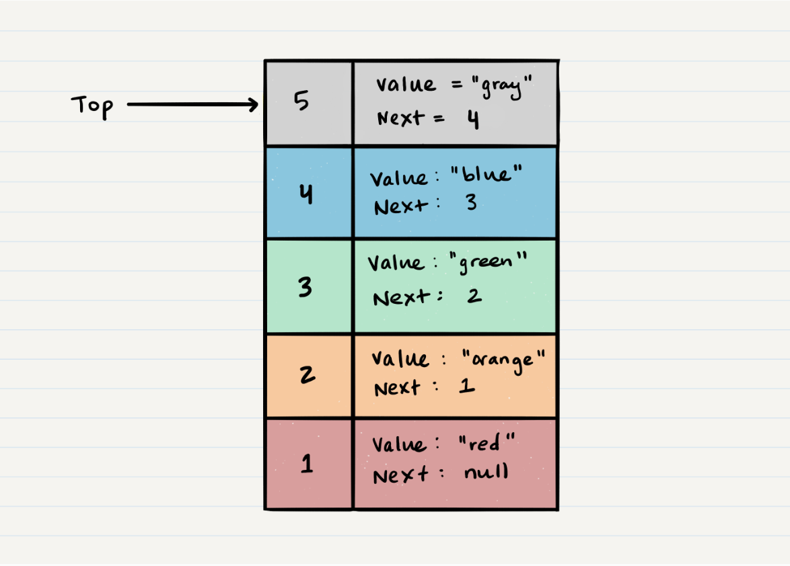

# Stacks and Queues

#### What is a Stack

> A stack is a data structure that consists of Nodes. Each Node references the next Node in the stack, but does not reference its previous.

#### *Common terminology for a stack is*

- Push: Nodes or items that are put into the stack are pushed

- Pop: Nodes or items that are removed from the stack are popped. When you attempt to pop an empty stack an exception will be raised.

- Top: This is the top of the stack.

- Peek: When you peek you will view the value of the top Node in the stack. When you attempt to peek an empty stack an exception will be raised.

- IsEmpty: returns true when stack is empty otherwise returns false.

#### Stacks follow these concepts:

1. FILO

> First In Last Out: this means that the first item added in the stack will be the last item popped out of the stack.

2. LIFO

> Last In First Out: this means that the last item added to the stack will be the first item popped out of the stack.

3. Stack Visualization

> Here’s an example of what a stack looks like. As you can see, the topmost item is denoted as the `top`. When you push something to the stack, it becomes the new `top`. When you pop something from the stack, you pop the current `top` and set the next `top` as `top.next`.

#### Push O(1)

> Pushing a Node onto a stack will always be an O(1) operation. This is because it takes the same amount of time no matter how many Nodes (n) you have in the stack. When adding a Node, you push it into the stack by assigning it as the new top, with its next property equal to the original top.

Let’s walk through the steps:

1. First, you should have the Node that you want to add. Here is an example of a Node that we want to add to the stack.

2. Next, you need to assign the next property of `Node 5` to reference the same Node that `top` is referencing: `Node 4`

3. Technically at this point, your new Node is added to your stack, but there is no indication that it is the first Node in the stack. To make this happen, you have to re-assign our reference `top` to the newly added Node, `Node 5`.

4. Congratulations! You completed a successful push of Node 5 onto the stack.

#### Pop O(1)

Popping a Node off a stack is the action of removing a Node from the top. When conducting a `pop`, the `top` Node will be re-assigned to the Node that lives below and the `top` Node is returned to the user.

Typically, you would check `isEmpty` before conducting a `pop`. This will ensure that an exception is not raised. Alternately, you can wrap the call in a try/catch block.

Let’s try and `pop` off `Node 5` from the stack. Here is a visual of the current state of our stack:

1. The first step of removing `Node 5` from the stack is to create a reference named `temp` that points to the same Node that `top` points to.

2. Once you have created the new reference type, you now need to re-assign `top` to the value that the `next` property is referencing. In our visual, we can see that the `next` property is pointing to `Node 4`. We will re-assign `top` to be `Node 4`.

3. We can now remove `Node 5` safely without it affecting the rest of the stack. Before we do that though you may want to make sure that you clear out the `next` property in your current `temp` reference. This will ensure that no further references to `Node 4` are floating around the heap. This will allow our garbage collector to cleanly and safely dispose of the Nodes correctly.

4. Finally, we return the value of the `temp` Node that was just popped off.

## Resource

- [CodeFellows.com]https://codefellows.github.io/common_curriculum/data_structures_and_algorithms/Code_401/class-10/resources/stacks_and_queues.html 
